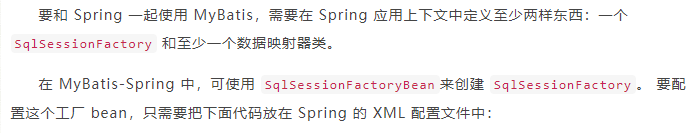

# mybatis demo

## 集成 UserMapperTest

### 方式一 mybatis-spring

- [mybatis-spring官网](https://mybatis.org/spring/zh/getting-started.html)
- [Spring集成MyBatis的三种实现方式](https://blog.csdn.net/m0_37989980/article/details/104758048)


```
<bean id="sqlSessionFactory" class="org.mybatis.spring.SqlSessionFactoryBean">
  <property name="dataSource" ref="dataSource" />
</bean>
```

```
    <!--配置sqlSession-->
    <bean id="sqlSession" class="org.mybatis.spring.SqlSessionTemplate">
        <!--只能通过构造器注入sqlSessionFactory,因为没有set方法-->
        <constructor-arg index="0" ref="sqlSessionFactory"/>
    </bean>

  <!-- 创建mapper对象-->
    <bean id="userMapperImpl" class="com.sunny.ssm.mapper.UserMapperImpl">
        <property name="sqlSession" ref="sqlSession"/>
    </bean>

public class UserMapperImpl implements UserMapper{
    
    private SqlSessionTemplate sqlSession;

    public void setSqlSession(SqlSessionTemplate sqlSession) {
        this.sqlSession = sqlSession;
    }

    public List<User> selectAll() {
        return sqlSession.getMapper(UserMapper.class).selectAll();
    }
}
```

### 方式二 mybatis-spring-boot-starter
- [MyBatis-Spring-Boot-Starter 介绍](http://www.mybatis.cn/archives/861.html)
- MyBatis-Spring-Boot-Starter 将会完成以下功能:
```
1、Autodetect an existing DataSource
自动发现存在的DataSource

2、Will create and register an instance of a SqlSessionFactory passing that DataSource as an input using the SqlSessionFactoryBean
利用SqlSessionFactoryBean创建并注册SqlSessionFactory

3、Will create and register an instance of a SqlSessionTemplate got out of the SqlSessionFactory
创建并注册SqlSessionTemplate

4、Auto-scan your mappers, link them to the SqlSessionTemplate and register them to Spring context so they can be injected into your beans
自动扫描Mappers，并注册到Spring上下文环境方便程序的注入使用
```

## 批量插入性能对比 BatchInsertTest
```
单位：ms
循环插入100000条数据耗时：----------------232320---------------
Mybatis batch模式插入100000条数据耗时：----------------216849---------------
Mybatis batch模式批量插入100000条数据耗时：----------------217056---------------
foreach循环插入100000条数据耗时：----------------143---------------

MyBatis-plus 批量插入方法：
https://blog.csdn.net/weixin_45505313/article/details/121574166

如果调用 IService#saveBatch() 方法保存有2个元素的实体集合 List<Node> 数据到数据库，其执行的 SQL 语句如下：
存在 2 条：
INSERT INTO node (name, version) VALUES (‘nathan’,1);
INSERT INTO node (name, version) VALUES (‘bob’,1);

而如果是数据库批量插入，其执行的 SQL 语句应该如下
只有 1 条：
INSERT INTO node (name, version) VALUES (‘nathan’,1), (‘bob’,1);
```
